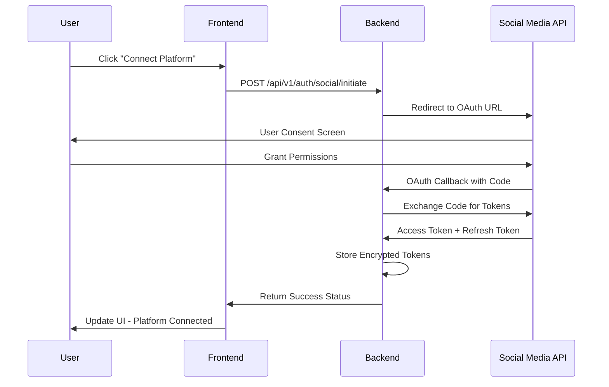

# ADR-004: Social Media OAuth Integration for Campaign Scheduling

**Date:** 2025-06-22  
**Status:** ACCEPTED ✅ IMPLEMENTED  
**Author:** JP  
**Context:** Google ADK Hackathon - AI Marketing Campaign Post Generator - Social Media Authentication

## Context

The current campaign scheduling page displays five social media platforms (LinkedIn, Twitter/X, Instagram, Facebook, TikTok) but only LinkedIn and Twitter are marked as "connected". Users need seamless OAuth authentication to schedule and publish AI-generated marketing content directly to their social media accounts from the campaign scheduling interface.

### Business Requirements
- Users must authenticate with social media platforms before scheduling posts
- Support for 5 major platforms: LinkedIn, Twitter/X, Instagram, Facebook, TikTok
- Seamless user experience within the campaign scheduling workflow
- Secure token management and refresh handling
- Platform-specific posting capabilities and limitations
- Error handling for authentication failures and API rate limits

## Decision

### 1. OAuth 2.0 Implementation Strategy

#### Supported Platforms & APIs
```typescript
const SOCIAL_PLATFORMS = {
  linkedin: {
    apiVersion: 'v2',
    oauth: 'OAuth 2.0',
    scopes: ['w_member_social', 'r_liteprofile'],
    postingEndpoint: '/v2/ugcPosts',
    charLimit: 3000,
    supportsImages: true,
    supportsVideo: true
  },
  twitter: {
    apiVersion: 'v2',
    oauth: 'OAuth 2.0 with PKCE',
    scopes: ['tweet.read', 'tweet.write', 'users.read'],
    postingEndpoint: '/2/tweets',
    charLimit: 280,
    supportsImages: true,
    supportsVideo: true
  },
  instagram: {
    apiVersion: 'Basic Display API + Graph API',
    oauth: 'OAuth 2.0',
    scopes: ['instagram_basic', 'instagram_content_publish'],
    postingEndpoint: '/me/media',
    charLimit: 2200,
    supportsImages: true,
    supportsVideo: true,
    requiresFacebookAuth: true
  },
  facebook: {
    apiVersion: 'Graph API v18.0',
    oauth: 'OAuth 2.0',
    scopes: ['pages_manage_posts', 'pages_read_engagement'],
    postingEndpoint: '/page-id/feed',
    charLimit: 63206,
    supportsImages: true,
    supportsVideo: true
  },
  tiktok: {
    apiVersion: 'TikTok for Developers',
    oauth: 'OAuth 2.0',
    scopes: ['video.upload', 'user.info.basic'],
    postingEndpoint: '/share/video/upload/',
    charLimit: 150,
    supportsImages: false,
    supportsVideo: true,
    requiresVideoContent: true
  }
}
```

### 2. High-Level Architecture

#### Authentication Flow


#### Database Schema Extensions
```sql
-- Social Media Connections Table
CREATE TABLE social_media_connections (
    id INTEGER PRIMARY KEY AUTOINCREMENT,
    user_id TEXT NOT NULL,
    platform TEXT NOT NULL,
    platform_user_id TEXT NOT NULL,
    platform_username TEXT,
    access_token TEXT NOT NULL,
    refresh_token TEXT,
    token_expires_at DATETIME,
    scopes TEXT,
    connection_status TEXT DEFAULT 'active',
    created_at DATETIME DEFAULT CURRENT_TIMESTAMP,
    updated_at DATETIME DEFAULT CURRENT_TIMESTAMP,
    UNIQUE(user_id, platform, platform_user_id)
);

-- Scheduled Posts Updates
ALTER TABLE scheduled_posts ADD COLUMN social_connection_id INTEGER;
ALTER TABLE scheduled_posts ADD COLUMN platform_post_id TEXT;
ALTER TABLE scheduled_posts ADD COLUMN posting_error TEXT;
```

### 3. Backend API Structure

#### Authentication Endpoints
```typescript
// Initiate OAuth Flow
POST /api/v1/auth/social/initiate
{
  "platform": "twitter" | "instagram" | "facebook" | "linkedin" | "tiktok",
  "callback_url": string
}
Response: {
  "oauth_url": string,
  "state": string
}

// OAuth Callback Handler
GET /api/v1/auth/social/callback/:platform?code={code}&state={state}
Response: {
  "success": boolean,
  "connection": {
    "platform": string,
    "username": string,
    "connected_at": string
  }
}

// Get User's Social Connections
GET /api/v1/auth/social/connections
Response: {
  "connections": SocialConnection[]
}

// Disconnect Platform
DELETE /api/v1/auth/social/disconnect/:platform
Response: {
  "success": boolean,
  "message": string
}
```

#### Publishing Endpoints
```typescript
// Schedule Posts to Social Media
POST /api/v1/posts/schedule
{
  "campaign_id": string,
  "posts": [{
    "content": string,
    "platforms": string[],
    "scheduled_time": string,
    "media_urls": string[]
  }],
  "scheduling_options": {
    "interval_hours": number,
    "start_time": string
  }
}

// Get Scheduled Posts Status
GET /api/v1/posts/scheduled/:campaign_id
Response: {
  "scheduled_posts": [{
    "id": string,
    "platform": string,
    "status": "pending" | "posted" | "failed",
    "scheduled_time": string,
    "posted_time": string | null,
    "platform_post_id": string | null,
    "error": string | null
  }]
}
```

### 4. Security Implementation

#### Token Management
```typescript
// Encrypted Token Storage
class SocialTokenManager {
  private encryptionKey: string;
  
  async storeTokens(userId: string, platform: string, tokens: OAuthTokens) {
    const encryptedTokens = await this.encrypt(tokens);
    await db.socialConnections.upsert({
      userId,
      platform,
      accessToken: encryptedTokens.access,
      refreshToken: encryptedTokens.refresh,
      expiresAt: new Date(Date.now() + tokens.expires_in * 1000)
    });
  }
  
  async getValidToken(userId: string, platform: string): Promise<string> {
    const connection = await db.socialConnections.findFirst({
      where: { userId, platform, status: 'active' }
    });
    
    if (!connection) throw new Error('Platform not connected');
    
    if (this.isTokenExpired(connection.expiresAt)) {
      return await this.refreshToken(connection);
    }
    
    return await this.decrypt(connection.accessToken);
  }
}
```

#### Environment Configuration
```env
# OAuth Client Credentials
LINKEDIN_CLIENT_ID=your_linkedin_client_id
LINKEDIN_CLIENT_SECRET=your_linkedin_client_secret
TWITTER_CLIENT_ID=your_twitter_client_id
TWITTER_CLIENT_SECRET=your_twitter_client_secret
INSTAGRAM_CLIENT_ID=your_instagram_client_id
INSTAGRAM_CLIENT_SECRET=your_instagram_client_secret
FACEBOOK_APP_ID=your_facebook_app_id
FACEBOOK_APP_SECRET=your_facebook_app_secret
TIKTOK_CLIENT_ID=your_tiktok_client_id
TIKTOK_CLIENT_SECRET=your_tiktok_client_secret

# Token Encryption
SOCIAL_TOKEN_ENCRYPTION_KEY=your_32_byte_encryption_key
OAUTH_STATE_SECRET=your_oauth_state_secret
```

### 5. Frontend Integration

#### Updated Platform Connection UI
```typescript
const PlatformConnectionButton = ({ platform, connected, onConnect, onDisconnect }) => {
  const [isConnecting, setIsConnecting] = useState(false);
  
  const handleConnect = async () => {
    setIsConnecting(true);
    try {
      const response = await api.post('/auth/social/initiate', {
        platform,
        callback_url: `${window.location.origin}/auth/social/callback`
      });
      
      // Open OAuth popup
      const popup = window.open(
        response.data.oauth_url,
        'social_auth',
        'width=600,height=600,scrollbars=yes,resizable=yes'
      );
      
      // Listen for successful authentication
      const checkClosed = setInterval(() => {
        if (popup.closed) {
          clearInterval(checkClosed);
          setIsConnecting(false);
          onConnect(); // Refresh connection status
        }
      }, 1000);
      
    } catch (error) {
      toast.error(`Failed to connect to ${platform}`);
      setIsConnecting(false);
    }
  };
  
  return (
    <button
      onClick={connected ? onDisconnect : handleConnect}
      disabled={isConnecting}
      className={`platform-button ${connected ? 'connected' : 'disconnected'}`}
    >
      {isConnecting ? 'Connecting...' : connected ? 'Connected' : 'Connect'}
    </button>
  );
};
```

### 6. Publishing Logic

#### Multi-Platform Publishing Service
```typescript
class SocialMediaPublisher {
  async publishPost(post: ScheduledPost): Promise<PublishResult> {
    const connection = await this.getConnection(post.userId, post.platform);
    const token = await this.tokenManager.getValidToken(post.userId, post.platform);
    
    try {
      switch (post.platform) {
        case 'twitter':
          return await this.publishToTwitter(post, token);
        case 'linkedin':
          return await this.publishToLinkedIn(post, token);
        case 'instagram':
          return await this.publishToInstagram(post, token);
        case 'facebook':
          return await this.publishToFacebook(post, token);
        case 'tiktok':
          return await this.publishToTikTok(post, token);
        default:
          throw new Error(`Unsupported platform: ${post.platform}`);
      }
    } catch (error) {
      await this.handlePublishingError(post, error);
      throw error;
    }
  }
  
  private async publishToTwitter(post: ScheduledPost, token: string) {
    const client = new TwitterApi(token);
    const tweet = await client.v2.tweet({
      text: post.content,
      media: post.mediaIds ? { media_ids: post.mediaIds } : undefined
    });
    
    return {
      success: true,
      platformPostId: tweet.data.id,
      publishedAt: new Date()
    };
  }
  
  // Similar methods for other platforms...
}
```

### 7. Error Handling & Resilience

#### Retry Logic and Error Recovery
```typescript
class PublishingScheduler {
  async processScheduledPosts() {
    const pendingPosts = await db.scheduledPosts.findMany({
      where: {
        status: 'pending',
        scheduledTime: { lte: new Date() }
      }
    });
    
    for (const post of pendingPosts) {
      try {
        await this.publishWithRetry(post);
      } catch (error) {
        await this.handleFailedPost(post, error);
      }
    }
  }
  
  private async publishWithRetry(post: ScheduledPost, maxRetries = 3) {
    for (let attempt = 1; attempt <= maxRetries; attempt++) {
      try {
        const result = await this.publisher.publishPost(post);
        await this.markPostAsPublished(post, result);
        return;
      } catch (error) {
        if (attempt === maxRetries) {
          throw error;
        }
        
        // Exponential backoff
        await this.delay(Math.pow(2, attempt) * 1000);
      }
    }
  }
}
```

## Implementation Plan

### Phase 1: Backend OAuth Infrastructure (Days 1-2)
- [ ] Set up OAuth endpoints for all 5 platforms
- [ ] Implement secure token storage and encryption
- [ ] Create database migrations for social connections
- [ ] Add environment configuration for OAuth credentials
- [ ] Implement token refresh logic

### Phase 2: Frontend Integration (Day 2)
- [ ] Update SchedulingPage.tsx with OAuth connection flow
- [ ] Implement popup-based authentication
- [ ] Add connection status management
- [ ] Update UI to show connected/disconnected states
- [ ] Add error handling for failed connections

### Phase 3: Publishing Logic (Day 3)
- [ ] Implement platform-specific publishing services
- [ ] Add scheduling queue processing
- [ ] Implement retry logic and error handling
- [ ] Add post status tracking and updates
- [ ] Test end-to-end publishing flow

### Phase 4: Testing & Documentation (Day 3)
- [ ] Add comprehensive tests for OAuth flows
- [ ] Test publishing to all platforms
- [ ] Update API documentation
- [ ] Add monitoring and logging
- [ ] Prepare demo scenarios

## Success Criteria

- [ ] Users can authenticate with all 5 social media platforms
- [ ] OAuth tokens are securely stored and automatically refreshed
- [ ] Posts can be successfully scheduled and published to connected platforms
- [ ] Error handling gracefully manages API failures and rate limits
- [ ] UI provides clear feedback on connection and publishing status
- [ ] System handles concurrent publishing to multiple platforms
- [ ] All tests pass for authentication and publishing flows

## Security Considerations

1. **Token Encryption**: All OAuth tokens encrypted at rest
2. **State Validation**: CSRF protection via OAuth state parameter
3. **Scope Limitation**: Minimal required permissions per platform
4. **Token Refresh**: Automatic token refresh before expiration
5. **Error Logging**: No sensitive data in logs
6. **Rate Limiting**: Respect platform API rate limits
7. **User Consent**: Clear permission disclosure

## Risks & Mitigations

**Risks:**
- OAuth implementation complexity across 5 different platforms
- Platform API changes breaking functionality
- Token management and refresh complexities
- Rate limiting affecting scheduling reliability

**Mitigations:**
- Phased implementation with thorough testing
- Abstracted platform interfaces for easier maintenance
- Robust error handling and retry logic
- Rate limit monitoring and intelligent queuing

## Future Enhancements

- Analytics integration for post performance tracking
- Advanced scheduling options (optimal timing)
- Bulk posting capabilities
- Team collaboration features
- Platform-specific content optimization

## Dependencies

- Platform OAuth Applications (must be created and approved)
- Environment configuration for OAuth credentials
- Database migrations for social connections
- Frontend popup authentication implementation
- Background job processing for scheduled posts

This ADR provides the foundation for implementing comprehensive social media OAuth integration that enables seamless campaign scheduling across all major platforms while maintaining security and reliability standards.