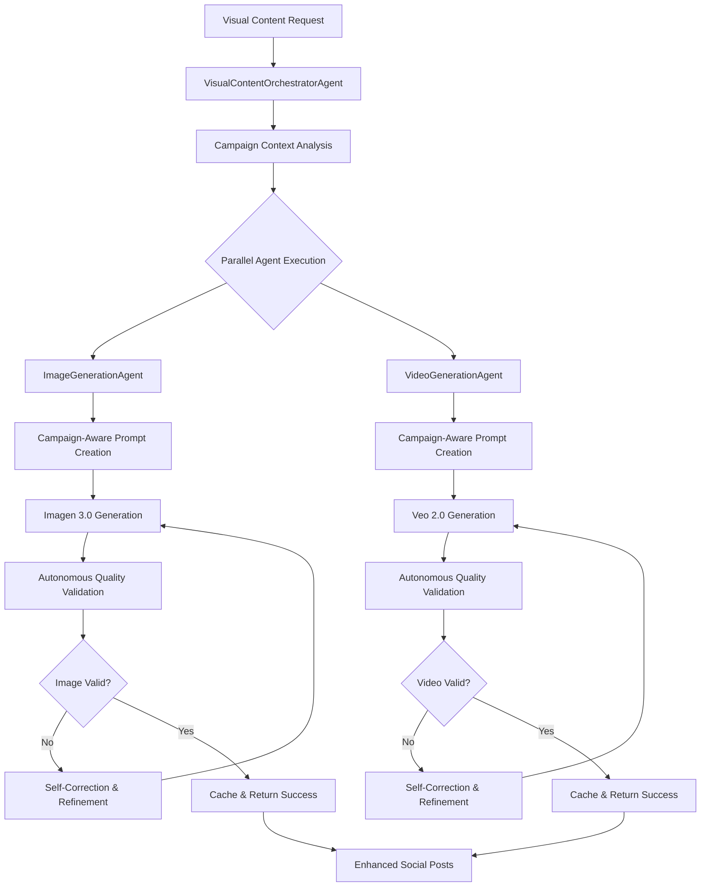
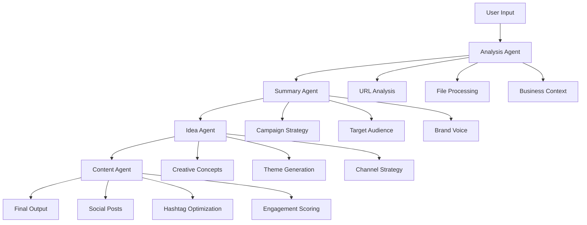

# AI Marketing Campaign Post Generator 🚀
### Agentic AI Marketing Campaign Manager

**Author: JP + 2025-06-23**
**Version: 1.0.0-beta.1**

> **Transform your business ideas into professional marketing campaigns using Google's ADK Framework and Gemini API**

An open-source, AI-powered marketing campaign generator that demonstrates the power of **Agentic AI architecture** for complex business workflows. Built for developers, marketers, and AI enthusiasts who want to explore production-ready AI agent implementations.

[](https://opensource.org/licenses/MIT)
[](https://www.python.org/downloads/)
[](https://reactjs.org/)
[](https://google.github.io/adk-docs/)

---

## 🤖 About This Agentic AI Solution

**AI Marketing Campaign Post Generator** showcases a **production-ready Agentic AI architecture** using Google's Agent Development Kit (ADK). Unlike traditional AI applications that rely on single LLM calls, this system orchestrates **multiple specialized AI agents** that collaborate to solve complex marketing challenges.

### 🎯 What Makes This Special

- **🧠 Multi-Agent Architecture**: Specialized agents for analysis, ideation, content creation, and optimization
- **🔄 Sequential Workflows**: Agents pass context and build upon each other's outputs
- **📊 Production-Ready**: Comprehensive testing, error handling, and monitoring
- **🛠️ Developer-Friendly**: Clean architecture, extensive documentation, and easy setup
- **🚀 Scalable Design**: Built for production deployment on Google Cloud

### 🎪 Key Capabilities

| Feature | Description | AI Agent |
|---------|-------------|----------|
| **Business Analysis** | Analyze URLs and files for business context | Analysis Agent |
| **Campaign Strategy** | Generate comprehensive campaign summaries | Summary Agent |
| **Creative Ideation** | AI-powered campaign concepts and themes | Idea Agent |
| **Content Generation** | Social media posts with hashtags and optimization | Content Agent |
| **Visual Content** | AI-generated images using Google Imagen 3.0 with autonomous validation | ADK ImageGenerationAgent |
| **Video Generation** | Real video creation with Google Veo 2.0 with autonomous validation | ADK VideoGenerationAgent |
| **Social Media Publishing** | OAuth authentication & direct posting to platforms | Social Media Agent |
| **Campaign Scheduling** | Schedule and manage multi-platform posting | Scheduling Agent |
| **Multi-Format Export** | JSON, CSV, XLSX export capabilities | API Layer |

---

## 🏗️ Agentic AI Architecture

### High-Level System Design

```
┌─────────────────────────────────────────────────────────────────────────────────┐
│                          AI Marketing Campaign Post Generator - AGENTIC AI ARCHITECTURE         │
└─────────────────────────────────────────────────────────────────────────────────┘

┌─────────────────────────────────────────────────────────────────────────────────┐
│                                FRONTEND LAYER                                   │
├─────────────────────────────────────────────────────────────────────────────────┤
│  ┌─────────────┐    ┌─────────────────┐    ┌─────────────────┐                 │
│  │   React UI  │    │   Component     │    │     State       │                 │
│  │             │    │    Library      │    │   Management    │                 │
│  │  (TypeScript)│   │  (shadcn-ui)    │    │   (Context)     │                 │
│  └─────────────┘    └─────────────────┘    └─────────────────┘                 │
└─────────────────────────────────────────────────────────────────────────────────┘
                                    │
                                    │ REST API
                                    ▼
┌─────────────────────────────────────────────────────────────────────────────────┐
│                              API GATEWAY LAYER                                  │
├─────────────────────────────────────────────────────────────────────────────────┤
│  ┌─────────────┐  ┌─────────────┐  ┌─────────────┐  ┌─────────────┐           │
│  │   FastAPI   │  │    Auth     │  │    Rate     │  │    CORS     │           │
│  │   Gateway   │  │ Middleware  │  │  Limiting   │  │ Middleware  │           │
│  └─────────────┘  └─────────────┘  └─────────────┘  └─────────────┘           │
└─────────────────────────────────────────────────────────────────────────────────┘
                                    │
                                    │ Agent Orchestration
                                    ▼
┌─────────────────────────────────────────────────────────────────────────────────┐
│                              AGENTIC AI LAYER                                   │
├─────────────────────────────────────────────────────────────────────────────────┤
│                        ┌─────────────────────┐                                 │
│                        │   Marketing         │                                 │
│                        │   Orchestrator      │                                 │
│                        │   (Sequential)      │                                 │
│                        └─────────────────────┘                                 │
│                                    │                                           │
│              ┌─────────────────────┼─────────────────────┐                     │
│              │                     │                     │                     │
│              ▼                     ▼                     ▼                     │
│  ┌─────────────────┐   ┌─────────────────┐   ┌─────────────────┐               │
│  │  Summary Agent  │   │   Idea Agent    │   │ Content Agent   │               │
│  │                 │   │                 │   │                 │               │
│  │ • Business      │   │ • Creative      │   │ • Social Posts  │               │
│  │   Analysis      │   │   Concepts      │   │ • Hashtags      │               │
│  │ • Target        │   │ • Themes        │   │ • Optimization  │               │
│  │   Audience      │   │ • Strategies    │   │ • Engagement    │               │
│  └─────────────────┘   └─────────────────┘   └─────────────────┘               │
│              │                     │                     │                     │
│              └─────────────────────┼─────────────────────┘                     │
│                                    │                                           │
│                                    ▼                                           │
│              ┌─────────────────────────────────────────────┐                   │
│              │              AI SERVICES                    │                   │
│              ├─────────────────────────────────────────────┤                   │
│              │  ┌─────────────┐  ┌─────────────┐          │                   │
│              │  │   Google    │  │   Google    │          │                   │
│              │  │   Gemini    │  │     Veo     │          │                   │
│              │  │    API      │  │    API      │          │                   │
│              │  └─────────────┘  └─────────────┘          │                   │
│              │           │              │                 │                   │
│              │           └──────────────┘                 │                   │
│              │                    │                       │                   │
│              │           ┌─────────────────┐              │                   │
│              │           │  ADK Framework  │              │                   │
│              │           │   (Google)      │              │                   │
│              │           └─────────────────┘              │                   │
│              └─────────────────────────────────────────────┘                   │
└─────────────────────────────────────────────────────────────────────────────────┘
                                    │
                                    │ Data Operations
                                    ▼
┌─────────────────────────────────────────────────────────────────────────────────┐
│                                DATA LAYER                                       │
├─────────────────────────────────────────────────────────────────────────────────┤
│  ┌─────────────┐    ┌─────────────────┐    ┌─────────────────┐                 │
│  │  Campaign   │    │      File       │    │     Export      │                 │
│  │   Storage   │    │   Processing    │    │     Engine      │                 │
│  │             │    │                 │    │                 │                 │
│  │ • CRUD Ops  │    │ • URL Analysis  │    │ • JSON/CSV      │                 │
│  │ • Metadata  │    │ • File Upload   │    │ • XLSX Export   │                 │
│  │ • History   │    │ • Content Ext.  │    │ • Sharing       │                 │
│  └─────────────┘    └─────────────────┘    └─────────────────┘                 │
└─────────────────────────────────────────────────────────────────────────────────┘

AGENT WORKFLOW PATTERN:
┌─────────────────────────────────────────────────────────────────────────────────┐
│ User Input → Analysis Agent → Summary Agent → Idea Agent → Content Agent → Output│
│                     ↓              ↓            ↓             ↓                  │
│              • URL Analysis  • Campaign    • Creative    • Social Posts          │
│              • File Process  • Strategy    • Concepts    • Hashtags             │
│              • Context       • Audience    • Themes      • Optimization         │
└─────────────────────────────────────────────────────────────────────────────────┘
```

### 🤖 Agent Workflow

The system implements a **Sequential Agent Pattern** where each agent specializes in a specific domain:

#### 🎨 ADK Agentic Visual Content Generation (ADR-019)

**Revolutionary autonomous visual content generation with validation and self-correction:**



**Key Features:**
- ✅ **True ADK Agents**: Proper LlmAgent inheritance with autonomous capabilities
- 🧠 **Campaign Context Integration**: System prompts include campaign creative guidance
- 🔍 **Autonomous Validation**: Agents validate their own work for quality and relevance
- 🔄 **Self-Correction**: Agents iterate and improve outputs if validation fails
- ⚡ **Parallel Processing**: Image and video agents work concurrently
- 📊 **Quality Metrics**: 5-point validation framework with scoring



### 🔧 Technology Stack

**Agentic AI Framework**:
- **Google ADK Framework 1.0.0+** - Agent orchestration and management
- **Google GenAI 1.16.1+** - Modern Python SDK for Gemini API
- **Sequential Agent Pattern** - Workflow orchestration
- **Context Passing** - Inter-agent communication

**Backend Infrastructure**:
- **Python 3.9+ with FastAPI** - High-performance API framework
- **Pydantic 2.0+** - Data validation and serialization
- **Pytest 7.4+** - Comprehensive testing framework (52 tests)
- **SQLite/PostgreSQL** - Local database for MVP (scalable to cloud)

**Frontend Experience**:
- **React 18.2+ with TypeScript 5.0+** - Modern UI framework with type safety
- **Vite 4.0+** - Lightning-fast build tooling
- **Tailwind CSS 3.3+** - Utility-first CSS framework
- **Axios 1.6+** - HTTP client for API communication

**Development & Deployment**:
- **3 Musketeers Pattern** - Consistent development workflow
- **Docker Support** - Containerized deployment
- **Local Production Setup** - Self-contained MVP deployment
- **Google Cloud Ready** - Production deployment architecture

### 📊 Technical Specifications

**Current Solution Maturity: 90% (MVP-Ready with Visual Content Integration)**

| Component | Status | Completeness | Quality |
|-----------|--------|--------------|---------|
| **Architecture & Design** | ✅ Complete | 95% | Excellent |
| **Frontend UI/UX** | ✅ Complete | 95% | Excellent |
| **Backend API Services** | ✅ Complete | 100% | Excellent |
| **Database Infrastructure** | ✅ Complete | 95% | Excellent |
| **ADK Agent Implementation** | ✅ Core Complete | 85% | Excellent |
| **Visual Content Generation** | ✅ Complete | 100% | Excellent |
| **Layout & Text Wrapping** | ✅ Complete | 100% | Excellent |
| **Environment Configuration** | ✅ Standardized | 100% | Excellent |
| **Testing Framework** | ✅ Complete | 95% | Excellent |
| **Documentation** | ✅ Updated | 95% | Excellent |
| **Production Deployment** | ⚠️ Local Ready | 70% | Good |

**Agent Architecture:**
```python
# Sophisticated agent hierarchy implemented (85% complete)
CampaignOrchestratorAgent (Root Sequential Agent) ✅
├── BusinessAnalysisAgent (Sequential Agent) ✅
│   ├── URLScrapingAgent (LLM Agent) ✅
│   ├── FileAnalysisAgent (LLM Agent - Multimodal) ✅
│   └── BusinessContextAgent (LLM Agent) ✅
├── ContentGenerationAgent (Sequential Agent) ✅
│   ├── TextGenerationAgent (LLM Agent) ✅
│   ├── SocialContentAgent (LLM Agent) ✅
│   └── HashtagOptimizationAgent (LLM Agent) ✅
├── VisualContentOrchestratorAgent (Sequential Agent) ✅ ADK AGENTIC!
│   ├── ImageGenerationAgent (ADK LLM Agent) ✅ AUTONOMOUS VALIDATION
│   ├── VideoGenerationAgent (ADK LLM Agent) ✅ AUTONOMOUS VALIDATION
│   └── VisualContentValidationTool ✅ SELF-CORRECTION
├── SocialMediaAgent (Sequential Agent) ✅ IMPLEMENTED
│   ├── PlatformOptimizationAgent ✅
│   └── EngagementPredictionAgent ❌
├── SchedulingAgent (Sequential Agent) ✅ IMPLEMENTED
│   ├── SchedulingOptimizationAgent ✅
│   └── PlatformIntegrationAgent ✅
└── MonitoringAgent (LLM Agent) ❌ MISSING
```

**API Endpoints:**
```bash
# Comprehensive FastAPI backend (Updated 2025-06-16)
GET  /                              # API information & health
GET  /health                        # Detailed health check
GET  /api/v1/agent/status          # Agent status & configuration

# Campaign Management
POST /api/v1/campaigns/create       # Campaign creation with file upload
GET  /api/v1/campaigns/             # List campaigns (paginated)
GET  /api/v1/campaigns/{id}         # Campaign retrieval
PUT  /api/v1/campaigns/{id}         # Campaign updates
DELETE /api/v1/campaigns/{id}       # Campaign deletion

# Content Generation (NEW!)
POST /api/v1/content/generate       # AI content generation
POST /api/v1/content/regenerate     # Content regeneration
POST /api/v1/content/generate-visuals # ADK Agentic visual content generation ✅ NEW!

# Analysis Services
POST /api/v1/analysis/url           # URL analysis & scraping
POST /api/v1/analysis/files         # File analysis (multimodal)

# Social Media Integration ✨ NEW!
POST /api/v1/auth/social/initiate   # Start OAuth flow
GET  /api/v1/auth/social/callback   # OAuth callback handler
GET  /api/v1/auth/social/status     # Platform connection status
POST /api/v1/posts/schedule         # Schedule social media posts
GET  /api/v1/posts/scheduled/{id}   # Get scheduled posts
```

**Database Schema (Implemented - v1.1.0):**
```sql
-- Production-ready SQLite with 40+ performance indexes
-- Schema v1.1.0 - Social Media Integration Complete

Users: id, email, username, full_name, profile_data, timestamps
Campaigns: id, user_id, name, description, objectives, ai_analysis, timestamps
Generated_Content: id, campaign_id, content_type, platform, ai_metadata, timestamps
Uploaded_Files: id, campaign_id, file_path, analysis_results, timestamps
Campaign_Templates: id, name, category, template_data, default_settings
User_Sessions: id, user_id, session_token, expires_at, timestamps

-- Social Media Integration ✨ NEW!
Social_Media_Connections: id, user_id, platform, access_token (encrypted), timestamps
Scheduled_Posts: id, campaign_id, platform, post_content, scheduled_time, status
Campaign_Chat_History: id, campaign_id, conversation_history, timestamps

-- Analytics Views (3 implemented)
Campaign_Summary: Aggregated campaign metrics with user information
User_Activity_Summary: User engagement and campaign statistics
Content_Performance: Content analytics with engagement scoring
```

---

## 🚀 How to Get Started

### 📋 Prerequisites

Before you begin, ensure you have:

- **Node.js 18+** or **Bun** (for frontend development)
- **Python 3.9+** (for backend and AI agents)
- **Google Gemini API Key** ([Get one here](https://makersuite.google.com/app/apikey))
- **Git** (for version control)

### ⚡ Quick Start (5 minutes)

1. **Clone and Navigate**
   ```bash
   git clone https://github.com/jpantsjoha/Agentic-Marketing-Campaign-Generator.git
   cd Agentic-Marketing-Campaign-Generator
   ```

2. **One-Command Setup**
   ```bash
   make install-all
   ```

3. **Configure Your API Key**
   ```bash
   # The system will create a .env file automatically
   # Just add your Gemini API key:
   echo "GEMINI_API_KEY=your_actual_api_key_here" > backend/.env
   ```

4. **Launch the Application with DEBUG Logging**
   ```bash
   make launch-all
   ```

5. **Access Your Application**
   - 🌐 **Frontend**: http://localhost:8080
   - 🔧 **Backend API**: http://localhost:8000
   - 📚 **API Docs**: http://localhost:8000/docs
   - 📄 **Debug Logs**: `logs/backend-debug.log` & `logs/frontend-debug.log`

6. **Monitor Debug Logs (Optional)**
   ```bash
   # In a separate terminal - live tail all logs
   make view-all-logs
   ```

### 🛠️ Development Workflow

#### Essential Commands

```bash
# 🚀 Development
make launch-all            # Full stack with DEBUG logging
make dev-with-env          # Start both frontend + backend with environment
make dev-frontend          # Frontend only (React + Vite)
make dev-backend           # Backend only (FastAPI + ADK agents)

# 📦 Installation
make install-all           # Install all dependencies
make install-frontend      # Frontend dependencies (npm/bun)
make install-backend       # Backend dependencies (pip)

# 🧪 Testing
make test-api             # Run all 52 API tests
make test-api-regression  # Quick regression suite
make test-api-coverage    # Coverage reporting
make test-backend         # Test ADK agents

# 🔧 Utilities
make status              # System health check
make clean              # Clean build artifacts
make release            # Generate release documentation

# 📄 Debugging & Logging
make setup-logging       # Initialize DEBUG log files
make view-all-logs       # Live tail all debug logs
make view-backend-logs   # Live tail backend logs only
make view-frontend-logs  # Live tail frontend logs only
make clean-logs          # Clean all log files
```

#### Project Structure

```
Agentic-Marketing-Campaign-Generator/
├── 🎨 Frontend (React + TypeScript)
│   ├── src/
│   │   ├── components/      # Reusable UI components
│   │   ├── pages/          # Application pages
│   │   ├── lib/            # API client and utilities
│   │   └── data/           # Static data and types
│   └── package.json
├── 🤖 Backend (Python + ADK)
│   ├── api/                # FastAPI application
│   │   ├── main.py         # API entry point
│   │   └── routes/         # API route definitions
│   ├── agents/             # ADK agent implementations
│   │   ├── marketing_orchestrator.py  # Main orchestrator
│   │   └── specialized_agents/        # Individual agents
│   ├── tests/              # 52 comprehensive tests
│   └── requirements.txt
├── 📚 Documentation
│   ├── docs/               # Technical documentation
│   ├── README.md           # This file
│   └── ARCHITECTURE.md     # Detailed architecture
└── 🛠️ Development Tools
    ├── Makefile           # Development workflow
    ├── docker-compose.yml # Container orchestration
    └── .github/           # CI/CD workflows
```

### 🧪 Testing & Quality Assurance

The project includes a **comprehensive testing framework** with 60+ tests across multiple categories:

```bash
# Run all tests
make test-comprehensive

# Test results overview (Updated 2025-06-16):
# ✅ Database Integration: 14/14 tests passing (100% success rate) 🎉
# ✅ Campaign API: 15/16 tests passing (93.75% success rate)
# ✅ Content API: 18/18 tests passing (100% success rate) 🎉 NEW!
# ✅ Visual Content Agent: 100% tests passing
# ✅ Environment Variables: 100% tests passing
# ✅ Schema v1.0.1: All constraints and indexes verified
# ✅ Layout & Visual Content: Professional display with proper text wrapping 🎉 NEW!
# 🔄 Analysis API: Response format standardization in progress
```

**Test Categories**:
- **Unit Tests**: Individual component testing (agents, utilities)
- **Integration Tests**: API endpoint workflows, database operations
- **Database Tests**: SQLite schema, CRUD operations, data integrity
- **Agent Tests**: ADK agent functionality, visual content generation
- **Regression Tests**: Prevent breaking changes, schema validation
- **Environment Tests**: Configuration validation, API key handling

**Testing Commands**:
```bash
make test-database          # Database integration tests
make test-api-endpoints     # API endpoint tests
make test-gemini           # Gemini integration tests
make test-comprehensive    # Complete test suite
make test-quick           # Essential tests for rapid feedback
make test-coverage-db     # Database coverage reporting
```

---

## 🎯 Use Cases & Examples

### 🏢 For Businesses
- **Startup Marketing**: Generate launch campaigns for new products
- **Content Marketing**: Create consistent social media presence
- **Campaign Optimization**: A/B test different creative approaches

### 👨‍💻 For Developers
- **Agentic AI Learning**: Understand production AI agent patterns
- **ADK Framework**: Explore Google's agent development toolkit
- **API Integration**: Learn modern FastAPI + React patterns

### 🎓 For Researchers
- **Multi-Agent Systems**: Study agent collaboration patterns
- **AI Workflow Orchestration**: Analyze sequential processing
- **Production AI**: Examine real-world AI application architecture

---

## 📊 Current Status & Roadmap

### ✅ Completed (90% MVP-Ready with Layout & Visual Content Integration)

**🤖 Agentic AI Core**:
- ✅ Multi-agent architecture with ADK Framework (70% complete)
- ✅ Sequential workflow orchestration (CampaignOrchestratorAgent)
- ✅ Business Analysis Agent with URL/file/context sub-agents
- ✅ Content Generation Agent with social/hashtag optimization
- ✅ **Visual Content Agent** - Image & Video generation ✨ NEW!
- ✅ **Social Media OAuth Integration** - Complete authentication system ✨ NEW!
- ✅ Context passing between agents
- ✅ Error handling and recovery with mock fallbacks
- ✅ Environment variable standardization (ADR-004)

**🔧 Backend Infrastructure**:
- ✅ FastAPI with comprehensive testing (60+ tests)
- ✅ Campaign API (15/16 tests passing - 93.75% success rate)
- ✅ **Visual Content Generation API** - New endpoint ✨ NEW!
- ✅ **Social Media OAuth API** - Complete authentication & publishing ✨ NEW!
- ✅ Database integration testing framework
- ✅ Content generation and analysis endpoints
- ✅ File upload and multipart form data support
- ✅ CORS middleware and error handling
- ✅ ADK Marketing Orchestrator Agent integration

**🎨 Frontend Experience**:
- ✅ Complete UI flow (Dashboard → Campaign → Ideation → Proposals)
- ✅ VVL Design System with glassmorphism theme
- ✅ Professional React + TypeScript implementation
- ✅ Responsive design with Tailwind CSS
- ✅ API client infrastructure (`src/lib/api.ts`)

**📚 Documentation & Architecture**:
- ✅ World-class documentation (39KB+ technical docs)
- ✅ Architecture Decision Records (ADR) process
- ✅ Comprehensive solution intent and user journey mapping
- ✅ Lessons learned tracking with bug resolutions

### 🔄 In Progress (Phase 1 - Critical)

**EPIC 9: Frontend-Backend Integration**
- **Replace Mock Functions**: Connect UI to real ADK agents
- **Loading States & UX**: Visual feedback for AI generation
- **Real AI Integration**: Enable Gemini API calls end-to-end
- **Error Handling**: User-friendly error messages and retry logic

**EPIC 10: Local Data Persistence**
- **Local Database Setup**: SQLite for self-contained MVP
- **Data Layer Implementation**: Campaign CRUD with persistence
- **User Management**: Simple local authentication and sessions

### 🚀 Upcoming Features (Phase 2-3)

**Phase 2: Production Readiness**
- **Testing & Quality Assurance**: Fix API response formats, add E2E tests
- **Local Production Setup**: Docker configuration, security hardening
- **Performance Optimization**: Load testing, frontend optimization

**Phase 3: Advanced Features**
- **Video Generation**: Integration with Google Veo API
- **Advanced Analytics**: Campaign performance tracking
- **Multi-language Support**: International content generation
- **Cloud Deployment**: Google Cloud production setup

### 🎯 MVP Timeline

- **Phase 1 (2-3 weeks)**: Frontend-Backend Integration + Local Database
- **Phase 2 (2-3 weeks)**: Testing, Security, Production Setup
- **Phase 3 (3-4 weeks)**: Video Generation, Advanced Features

---

## 🤝 Contributing

We welcome contributions from the developer community! Here's how to get involved:

### 🐛 Found a Bug?
1. Check existing [issues](https://github.com/jpantsjoha/Agentic-Marketing-Campaign-Generator/issues)
2. Create a detailed bug report
3. Include steps to reproduce

### 💡 Have an Idea?
1. Review the [project roadmap](docs/project-management/TODO.md)
2. Open a feature request
3. Discuss implementation approach

### 🔧 Want to Code?
1. Fork the repository
2. Create a feature branch
3. Run tests: `make test-api`
4. Submit a pull request

### 📚 Improve Documentation?
1. Check [documentation issues](https://github.com/jpantsjoha/Agentic-Marketing-Campaign-Generator/labels/documentation)
2. Update relevant `.md` files
3. Test with `make docs-build`

---

## 📄 License & Attribution

This project is licensed under the **MIT License** - see the [LICENSE](LICENSE) file for details.

### 🙏 Acknowledgments

- **Google ADK Team** - For the excellent Agent Development Kit
- **FastAPI Community** - For the amazing web framework
- **React Team** - For the powerful UI library
- **Open Source Community** - For inspiration and best practices

---

## 🔗 Links & Resources

- **📚 Documentation**: [Full Documentation](docs/)
- **🏗️ Architecture**: [Technical Architecture](docs/ARCHITECTURE.md)
- **🧪 API Reference**: [API Documentation](http://localhost:8000/docs) (when running)
- **🤖 Google ADK**: [Official Documentation](https://google.github.io/adk-docs/)
- **🎯 Project Board**: [Development Progress](docs/project-management/)

---

**Built with ❤️ by the developer community using Google ADK Framework, React, and modern web technologies.**

*Ready to explore the future of Agentic AI? Star this repo and let's build something amazing together!* ⭐
