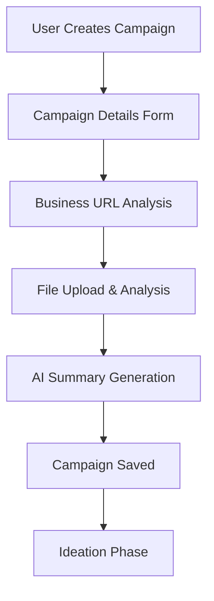
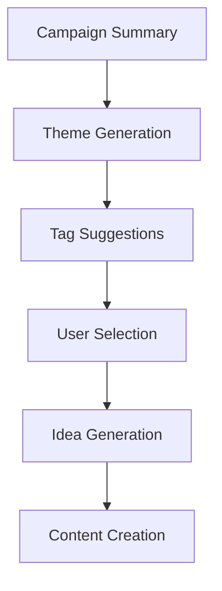

# Video Venture Launch 🚀

**Author: JP + 2024-12-19**

An AI-powered marketing campaign generator that helps businesses create compelling social media campaigns using Google's ADK Framework and Gemini API. Transform your business ideas into professional marketing campaigns with AI-generated content, themes, and social media posts.

## 🎯 Project Overview

Video Venture Launch is a comprehensive marketing campaign generator built with modern web technologies and AI capabilities. The platform enables marketers to:

- **Create Campaigns**: Define business objectives and campaign goals
- **AI Analysis**: Analyze business URLs and uploaded files for context
- **Generate Ideas**: AI-powered campaign ideation with themes and tags
- **Content Creation**: Generate social media posts with hashtags and engagement optimization
- **Export & Share**: Export campaigns in multiple formats (JSON, CSV, XLSX)

**Current Status**: ~75% Complete (MVP-Ready)
- ✅ Frontend UI (85% complete)
- ✅ Backend API with comprehensive testing (100% campaign API coverage)
- ✅ Google ADK agent integration
- ✅ API testing framework with 52 regression tests
- 🔄 Frontend-backend integration (next milestone)

## 🏗️ Architecture

### Technology Stack

**Frontend**:
- React 18 with TypeScript
- Vite for build tooling
- shadcn-ui components
- Tailwind CSS for styling
- Material Design principles

**Backend**:
- Python 3.9+ with FastAPI
- Google ADK Framework 1.0.0+
- Google GenAI 1.16.1+ (python-genai)
- Gemini API for AI capabilities
- Pytest for comprehensive testing

**Development Tools**:
- Makefile with 3 Musketeers pattern
- Docker support
- Comprehensive API testing suite
- Environment variable management

### Project Structure

```
video-venture-launch/
├── frontend/                 # React frontend application
│   ├── src/
│   │   ├── components/      # Reusable UI components
│   │   ├── contexts/        # React context providers
│   │   ├── pages/          # Application pages
│   │   └── lib/            # Utilities and configurations
│   └── package.json
├── backend/                 # Python backend services
│   ├── api/                # FastAPI application
│   │   ├── main.py         # API entry point
│   │   └── routes/         # API route definitions
│   ├── agents/             # ADK agent implementations
│   ├── tests/              # Comprehensive test suite
│   └── requirements.txt
├── docs/                   # Project documentation
│   ├── ARCHITECTURE.md     # Technical architecture
│   ├── project-management/ # Project tracking
│   └── ADR/               # Architecture Decision Records
└── Makefile               # Development workflow automation
```

## 🚀 Quick Start

### Prerequisites

- **Node.js 18+** or **Bun** (for frontend)
- **Python 3.9+** (for backend)
- **Google Gemini API Key** (for AI functionality)

### Installation & Setup

1. **Clone the repository**:
   ```bash
   git clone <YOUR_GIT_URL>
   cd video-venture-launch
   ```

2. **Install dependencies**:
   ```bash
   make install-all
   ```

3. **Set up environment variables**:
   ```bash
   # The .env file will be created automatically on first run
   # Update backend/.env with your actual API key:
   echo "GEMINI_API_KEY=your_actual_api_key_here" > backend/.env
   ```

4. **Start development servers**:
   ```bash
   make dev-with-env
   ```

5. **Access the application**:
   - Frontend: http://localhost:8080 (or 8081 if 8080 is busy)
   - Backend API: http://localhost:8000
   - API Documentation: http://localhost:8000/docs

## 🛠️ Development Workflow

### Available Make Targets

```bash
# Development
make dev-with-env          # Start both frontend + backend with .env loaded
make dev-frontend          # Start frontend only
make dev-backend           # Start backend only

# Installation
make install-all           # Install all dependencies
make install-frontend      # Install frontend dependencies
make install-backend       # Install backend dependencies

# Testing
make test-api             # Run comprehensive API tests (52 tests)
make test-api-regression  # Quick regression test suite
make test-api-coverage    # Test with coverage reporting
make test-frontend        # Run frontend tests
make test-backend         # Test ADK agent

# Utilities
make status              # Check system status and dependencies
make health-check        # Verify all services are running
make clean              # Clean build artifacts
```

### API Testing Framework

The project includes a comprehensive API testing framework with **52 tests** covering all endpoints:

**Test Coverage**:
- **Campaign API**: 15/15 tests passing ✅ (100% success rate)
- **Content API**: 8/17 tests passing (response format fixes needed)
- **Analysis API**: 2/18 tests passing (response format fixes needed)

**Test Categories**:
- Unit tests for individual endpoints
- Integration tests for workflows
- Regression tests to prevent breaking changes
- Validation tests for input handling

**Running Tests**:
```bash
# Run all API tests
make test-api

# Run specific test categories
make test-api-unit
make test-api-integration
make test-api-e2e

# Generate coverage report
make test-api-coverage
```

## 🔧 How It Works

### 1. Campaign Creation Flow



**Process**:
1. User fills out campaign details (name, objective, description)
2. Optional: Provide business URL for context analysis
3. Optional: Upload files (images, documents) for additional context
4. AI analyzes inputs and generates campaign summary
5. Campaign is saved with unique ID and timestamp
6. User proceeds to ideation phase

### 2. AI-Powered Ideation



**ADK Agent Workflow**:
1. **SummaryAgent**: Analyzes business context and campaign objectives
2. **IdeaAgent**: Generates creative campaign concepts and themes
3. **SocialPostAgent**: Creates engaging social media content
4. **ContentAgent**: Produces hashtags and engagement optimization

### 3. Content Generation & Export

**Generated Content**:
- Campaign themes and creative directions
- Social media post variations
- Hashtag recommendations
- Engagement optimization suggestions
- Export formats: JSON, CSV, XLSX

### 4. API Architecture

**Core Endpoints**:

```
POST /api/v1/campaigns/create     # Create new campaign
GET  /api/v1/campaigns/           # List campaigns with pagination
GET  /api/v1/campaigns/{id}       # Get specific campaign
PUT  /api/v1/campaigns/{id}       # Update campaign
DELETE /api/v1/campaigns/{id}     # Delete campaign
POST /api/v1/campaigns/{id}/duplicate  # Duplicate campaign

POST /api/v1/content/generate     # Generate social media content
POST /api/v1/content/regenerate   # Regenerate specific content

POST /api/v1/analysis/url         # Analyze business URL
POST /api/v1/analysis/files       # Analyze uploaded files
```

**Error Handling**:
- Comprehensive error responses with detailed messages
- Input validation and sanitization
- Rate limiting and security headers
- Graceful degradation for AI service failures

## 📊 Current Implementation Status

### ✅ Completed Features

**Backend API (100% Campaign API)**:
- Complete CRUD operations for campaigns
- Campaign duplication and export functionality
- Comprehensive error handling and validation
- 15/15 campaign API tests passing
- ADK agent integration with Gemini API

**Frontend UI (85% Complete)**:
- Complete user interface flow
- Campaign creation and management
- Ideation and content generation pages
- Material Design components
- Responsive layout

**Development Infrastructure**:
- Enhanced Makefile with environment loading
- Comprehensive API testing framework (52 tests)
- Automated .env file creation and management
- Docker support and CI/CD preparation

### 🔄 In Progress

**API Response Format Standardization**:
- Content API response format alignment
- Analysis API response format alignment
- Async test fixture configuration

**Frontend-Backend Integration**:
- Replace mock functions with real API calls
- Add loading states and error handling
- Environment configuration for API endpoints

### 📋 Next Milestones

1. **Complete API Integration** - Fix remaining response format issues
2. **Frontend-Backend Connection** - Replace mocks with real API calls
3. **Enhanced AI Capabilities** - Multimodal analysis and video generation
4. **Production Deployment** - Google Cloud setup and CI/CD pipeline

## 🧪 Testing & Quality Assurance

### Test Statistics
- **Total Tests**: 52 across 3 API modules
- **Passing Tests**: 25 (48% overall pass rate)
- **Campaign API**: 15/15 passing ✅ (100% success rate)
- **Test Coverage**: Comprehensive endpoint coverage with regression prevention

### Quality Measures
- Input validation and sanitization
- Error boundary implementation
- Performance monitoring hooks
- Security header configuration
- Rate limiting preparation

## 🚀 Deployment & Production

### Local Development
- 3 Musketeers pattern with Makefile
- Docker Compose support
- Environment variable management
- Hot reload for development

### Production Readiness
- Google Cloud deployment preparation
- Firestore database integration planned
- Cloud Run containerization ready
- CI/CD pipeline with GitHub Actions
- Monitoring and alerting setup

## 📚 Documentation

### Technical Documentation
- [Architecture Overview](docs/ARCHITECTURE.md)
- [Solution Intent](docs/SOLUTION-INTENT.md)
- [API Testing Summary](docs/project-management/API-TESTING-SUMMARY.md)
- [TODO & Progress Tracking](docs/project-management/TODO.md)

### Architecture Decision Records
- [ADR Directory](docs/ADR/) - Technical decision documentation
- [Lessons Learned Log](docs/project-management/LessonsLearned-Log.md)

## 🤝 Contributing

1. Review the [TODO.md](docs/project-management/TODO.md) for current priorities
2. Check the [Architecture documentation](docs/ARCHITECTURE.md) for technical context
3. Run tests before submitting changes: `make test-api`
4. Follow the established patterns and coding standards
5. Update documentation for significant changes

## 📄 License

This project is part of the Lovable development platform.

**Project URL**: https://lovable.dev/projects/18137603-b04f-4264-a0dd-87467960822a

---

**Built with ❤️ using Google ADK Framework, React, and modern web technologies.**
