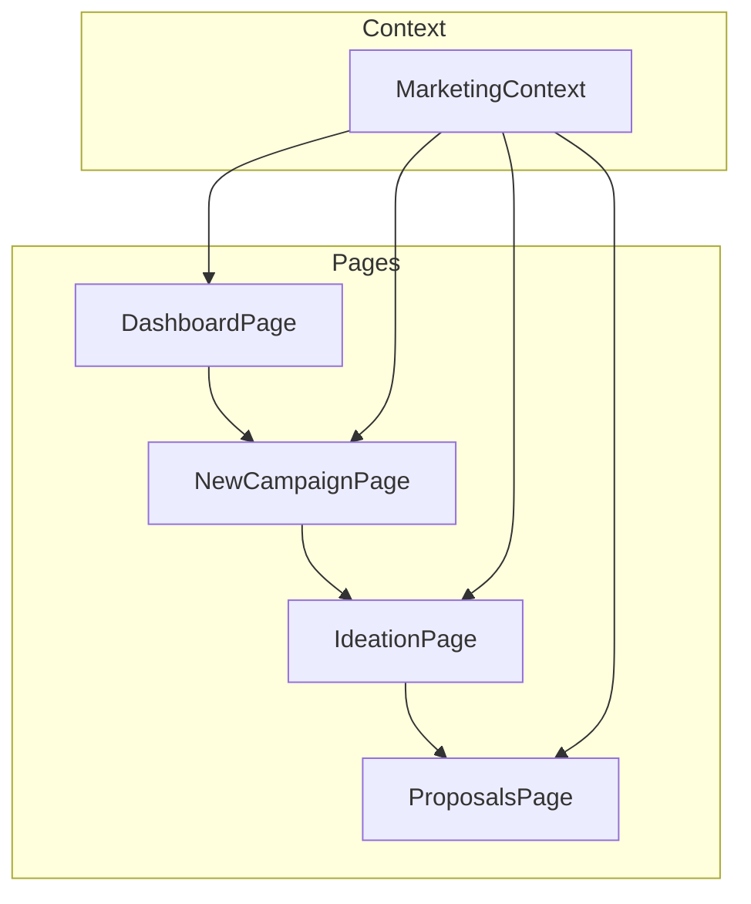
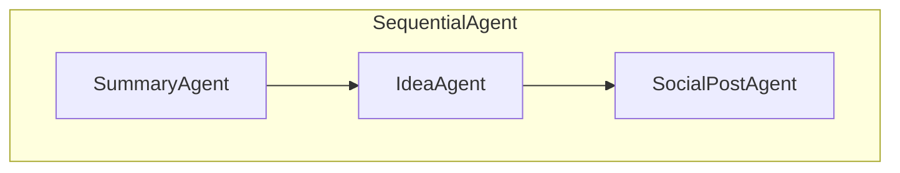
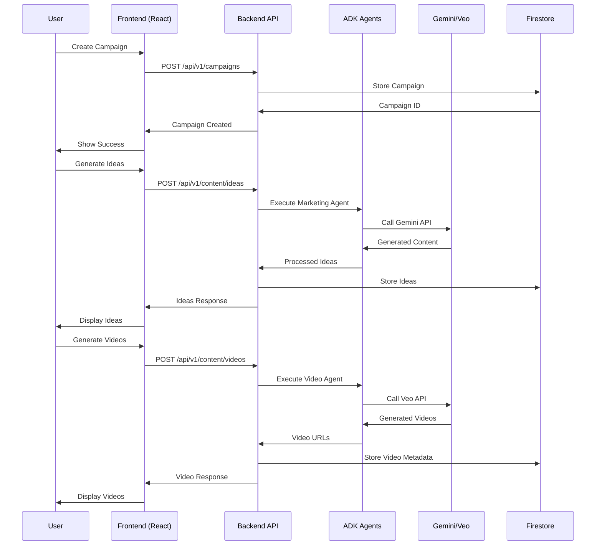

# Solution Architecture Overview

**Author: JP + 2025-06-15**
**Last Updated**: 2025-06-15

This document summarizes the current state and target architecture of the AI Marketing Campaign Post Generator platform. It reconciles the code with the solution intent of enabling marketers to create campaigns, generate social posts, and produce video content via Gemini/Veo APIs.

> **📋 Note**: For comprehensive solution intent, data flow patterns, and best practices, see [`SOLUTION-INTENT.md`](./SOLUTION-INTENT.md)

## Current State vs Target Architecture

### Current State (POC - 30% Complete)
- ✅ React frontend with complete UI flow
- ✅ Python ADK agent (standalone)
- ❌ Frontend-backend integration
- ❌ Real AI functionality (mocked)
- ❌ Persistent data storage

### Target Architecture (Production Ready)
- ✅ React frontend with real AI integration
- ✅ FastAPI backend wrapping ADK agents
- ✅ Firestore database for persistence
- ✅ Google Cloud deployment
- ✅ Comprehensive testing and monitoring

## High Level Design (HLD)

### Current POC Architecture

The solution currently consists of a small Python back‑end agent and a React front‑end with no integration between them.

```mermaid
flowchart TD
    subgraph Front-end (React)
        A[New Campaign Page]
        B[Ideation Page]
        C[Proposals Page]
        D[Dashboard]
        A --> B --> C
        C --> D
    end

    subgraph Back-end (Python ADK)
        E[marketing_agent.py]
    end

    A -- campaign data --> D
    B -- ideas/tags/themes --> C
    C -- optional call --> E
```

- **Front-end**: Built with Vite and React. Complete UI flow from campaign creation to content generation. All AI functionality is currently mocked.
- **Back-end**: `backend/marketing_agent.py` defines a `SequentialAgent` using Gemini. Currently standalone, executed via ADK CLI.
- **Data Storage**: Campaigns stored in browser `localStorage` only. No persistent database.
- **Integration**: Frontend and backend are completely disconnected.

### Target Production Architecture

```
┌─────────────────────────────────────────────────────────────────────────┐
│                              USER LAYER                                │
│  ┌─────────────┐  ┌─────────────┐  ┌─────────────┐  ┌─────────────┐   │
│  │   Browser   │  │   Mobile    │  │   Desktop   │  │   API       │   │
│  │     App     │  │     App     │  │     App     │  │  Clients    │   │
│  └─────────────┘  └─────────────┘  └─────────────┘  └─────────────┘   │
└─────────────────────────────────────────────────────────────────────────┘
                                    │
                                HTTPS/WSS
                                    │
┌─────────────────────────────────────────────────────────────────────────┐
│                           PRESENTATION LAYER                           │
│  ┌─────────────────────────────────────────────────────────────────────┐ │
│  │                    React Frontend (SPA)                            │ │
│  │  ┌─────────────┐ ┌─────────────┐ ┌─────────────┐ ┌─────────────┐   │ │
│  │  │ Dashboard   │ │  Campaign   │ │  Ideation   │ │ Proposals   │   │ │
│  │  │    Page     │ │  Creation   │ │    Page     │ │    Page     │   │ │
│  │  └─────────────┘ └─────────────┘ └─────────────┘ └─────────────┘   │ │
│  └─────────────────────────────────────────────────────────────────────┘ │
└─────────────────────────────────────────────────────────────────────────┘
                                    │
                                REST API
                                    │
┌─────────────────────────────────────────────────────────────────────────┐
│                            API GATEWAY                                 │
│  ┌─────────────────────────────────────────────────────────────────────┐ │
│  │  Load Balancer │ Authentication │ Rate Limiting │ Request Routing  │ │
│  └─────────────────────────────────────────────────────────────────────┘ │
└─────────────────────────────────────────────────────────────────────────┘
                                    │
┌─────────────────────────────────────────────────────────────────────────┐
│                           SERVICE LAYER                                │
│  ┌─────────────┐  ┌─────────────┐  ┌─────────────┐  ┌─────────────┐   │
│  │  Campaign   │  │   Content   │  │    User     │  │   Asset     │   │
│  │   Service   │  │  Generator  │  │   Service   │  │  Service    │   │
│  │  (FastAPI)  │  │   Service   │  │  (FastAPI)  │  │ (FastAPI)   │   │
│  └─────────────┘  └─────────────┘  └─────────────┘  └─────────────┘   │
└─────────────────────────────────────────────────────────────────────────┘
                                    │
┌─────────────────────────────────────────────────────────────────────────┐
│                        AI INTEGRATION LAYER                            │
│  ┌─────────────┐  ┌─────────────┐  ┌─────────────┐  ┌─────────────┐   │
│  │   Google    │  │   Google    │  │    ADK      │  │   Other     │   │
│  │   Gemini    │  │     Veo     │  │   Agents    │  │    APIs     │   │
│  │     API     │  │     API     │  │             │  │             │   │
│  └─────────────┘  └─────────────┘  └─────────────┘  └─────────────┘   │
└─────────────────────────────────────────────────────────────────────────┘
                                    │
┌─────────────────────────────────────────────────────────────────────────┐
│                            DATA LAYER                                  │
│  ┌─────────────┐  ┌─────────────┐  ┌─────────────┐  ┌─────────────┐   │
│  │  Firestore  │  │   Cloud     │  │    Redis    │  │  External   │   │
│  │  Database   │  │   Storage   │  │    Cache    │  │    APIs     │   │
│  │             │  │   (Media)   │  │             │  │             │   │
│  └─────────────┘  └─────────────┘  └─────────────┘  └─────────────┘   │
└─────────────────────────────────────────────────────────────────────────┘
```

**Target Components**:
- **Frontend**: React SPA with real AI integration via REST APIs
- **Backend**: FastAPI services wrapping ADK agents with proper error handling
- **Database**: Firestore for campaigns, Cloud Storage for media assets
- **AI Services**: Integrated Gemini/Veo APIs through ADK agents
- **Infrastructure**: Google Cloud with auto-scaling and monitoring

## Low Level Design (LLD)

### Front-end Modules



- **`MarketingContext`** (`src/contexts/MarketingContext.tsx`)
  - Holds the array of campaigns, the currently loaded campaign, generated ideas, and selected tags/themes.
  - Provides actions to create campaigns, generate ideas (mocked), generate videos (mocked), toggle selected ideas, and export results to a text file.
  - Persists campaigns and the current campaign in `localStorage`.

- **Pages**
  - **DashboardPage** lists saved campaigns from local storage. Users can load an existing campaign or create a new one.
  - **NewCampaignPage** captures the campaign name, objective, description, and optional example content.
  - **IdeationPage** displays an AI summary, suggested themes, and suggested tags. The user selects themes/tags and optionally a preferred design language before generating ideas.
  - **ProposalsPage** shows generated ideas, allows selection of ideas for video generation, and (once implemented) will display generated videos and social posts.

- **Components** (under `src/components`) provide Material‑style UI elements such as `MaterialButton`, `MaterialCard`, and `MaterialVideoCard`.

### Back-end Agent



- The `SummaryAgent` summarizes the user provided business description and objective.
- The `IdeaAgent` generates three campaign ideas using that summary.
- The `SocialPostAgent` writes short social posts for each idea.
- These agents run sequentially when executed via `google.adk.cli`.

## User Data Journey (Corrected)

### Current POC Flow (Disconnected)

```
USER → FRONTEND (React) → localStorage
                ↓
         Mocked AI Functions
                ↓
         UI State Updates

BACKEND (ADK Agent) ← Manual CLI Execution ← Developer
```

### Target Production Flow (Integrated)

```
USER → FRONTEND → API CALLS → BACKEND SERVICES → AI SERVICES → DATABASE
  ↑                                                                ↓
  └─────────────── RESPONSE FLOW ←←←←←←←←←←←←←←←←←←←←←←←←←←←←←←←←←←←←┘
```

### Detailed Sequence Diagram (Target)



### Data Flow Principles

1. **Stateless Frontend**: React maintains UI state only, no business logic
2. **API-First Backend**: All data operations through RESTful APIs
3. **Centralized Business Logic**: Backend services handle all AI integration
4. **Persistent Storage**: Firestore as single source of truth
5. **Real-time Updates**: WebSocket connections for long-running AI operations

## Integration Architecture

### Current Implementation Status (v0.9.0)

| Component | Current State | Implementation Status | Notes |
|-----------|---------------|----------------------|-------|
| **Frontend** | Complete UI with real API integration | ✅ **REAL** | Professional UI, API calls working |
| **Backend API** | FastAPI service with ADK agents | ✅ **REAL** | All endpoints functional |
| **Database** | SQLite with comprehensive schema | ✅ **REAL** | Production-ready, 95% complete |
| **ADK Agents** | Complete agent hierarchy defined | 🔶 **MOCK EXECUTION** | Agents structured but using mock workflow |
| **AI Integration** | Mock responses with real API structure | 🔶 **MOCK DATA** | GEMINI_API_KEY integration pending |
| **Visual Content** | Agent definitions with mock generation | 🔶 **MOCK CONTENT** | Placeholder URLs instead of real AI |
| **Authentication** | None | ❌ **NOT IMPLEMENTED** | Future enhancement |

### Critical Gaps for v1.0.0 (Full Functional Release)

| Gap | Location | Impact | Effort |
|-----|----------|--------|--------|
| **ADK Runner Integration** | `marketing_orchestrator.py:391` | All AI calls return mock data | 1-2 weeks |
| **Real Visual Generation** | `visual_content_agent.py:280-320` | Placeholder images/videos | 1 week |
| **Production Deployment** | Infrastructure | No cloud hosting | 1 week |
| **GEMINI_API_KEY Testing** | Environment configuration | Untested real AI integration | 3-5 days |

### Migration Strategy

1. **Phase 1**: Create FastAPI wrapper for existing ADK agent
2. **Phase 2**: Replace frontend mocks with API calls
3. **Phase 3**: Implement Firestore data persistence
4. **Phase 4**: Add authentication and authorization
5. **Phase 5**: Deploy to Google Cloud with monitoring

At present, the AI calls are mocked in the frontend and the Python agent runs standalone via CLI. The target architecture integrates these components through a proper API layer with persistent storage and real-time AI generation capabilities.

## 🎯 Enhanced Campaign Creation Flow

### Smart Business Analysis
The campaign creation process now includes intelligent business context gathering:

1. **URL Analysis**: AI agent scrapes and analyzes business websites, about pages, and product pages
2. **File Upload Processing**: Gemini analyzes uploaded images, documents, and existing campaign assets
3. **Automated Context Extraction**: Reduces manual input by automatically understanding business purpose, sector, and locality

### Campaign Preparation Agent Features

#### URL-Based Analysis
- **Business Website**: Main company website analysis for brand understanding
- **About Page**: Company mission, values, and team analysis
- **Product/Service Pages**: Specific offering analysis for targeted campaigns

#### File Upload & Analysis
- **Product/Brand Images**: Visual analysis for design direction and brand consistency
- **Documents & Specs**: Technical specifications, product details, service descriptions
- **Existing Campaign Assets**: Reference materials for style and messaging consistency

#### AI Creativity Controls
- **Creativity Dial**: 1-10 scale controlling AI experimental vs. conservative approach
  - 1-3: Conservative (proven strategies, safe messaging)
  - 4-6: Balanced (mix of proven and creative approaches)
  - 7-8: Innovative (creative concepts, unique angles)
  - 9-10: Experimental (cutting-edge, high-risk/high-reward ideas)

#### Campaign Type Classification
- **Product Launch**: New product introduction campaigns
- **Service Promotion**: Service-based business marketing
- **Brand Awareness**: Company/brand visibility campaigns  
- **Event Marketing**: Event promotion and attendance campaigns

### Backend Agent Integration

The enhanced campaign creation requires new backend endpoints:

```
POST /api/v1/campaigns/analyze-url
POST /api/v1/campaigns/analyze-files
POST /api/v1/campaigns/create-enhanced
```

#### URL Analysis Agent
```python
@tracer.span("analyze_business_url")
async def analyze_business_url(url: str, analysis_type: str) -> BusinessContext:
    """
    Scrape and analyze business URLs for context extraction
    - Extracts business purpose, sector, target audience
    - Identifies key products/services
    - Analyzes brand tone and messaging
    """
```

#### File Analysis Agent  
```python
@tracer.span("analyze_campaign_files")
async def analyze_campaign_files(files: List[File], file_type: str) -> FileAnalysis:
    """
    Process uploaded files using Gemini multimodal capabilities
    - Image analysis for visual direction
    - Document parsing for detailed context
    - Asset analysis for style consistency
    """
```

#### Enhanced Campaign Context
```python
class EnhancedCampaignContext:
    # Basic campaign info
    name: str
    objective: str
    campaign_type: CampaignType
    
    # AI-extracted context
    business_context: BusinessContext
    visual_analysis: VisualAnalysis
    document_insights: DocumentInsights
    
    # User preferences
    creativity_level: int
    preferred_design: Optional[str]
    
    # Source materials
    reference_urls: List[str]
    uploaded_assets: List[FileReference]
```

