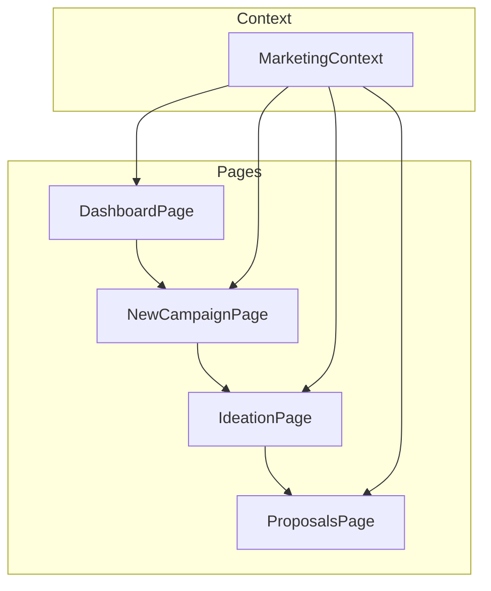
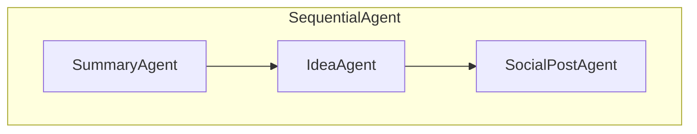
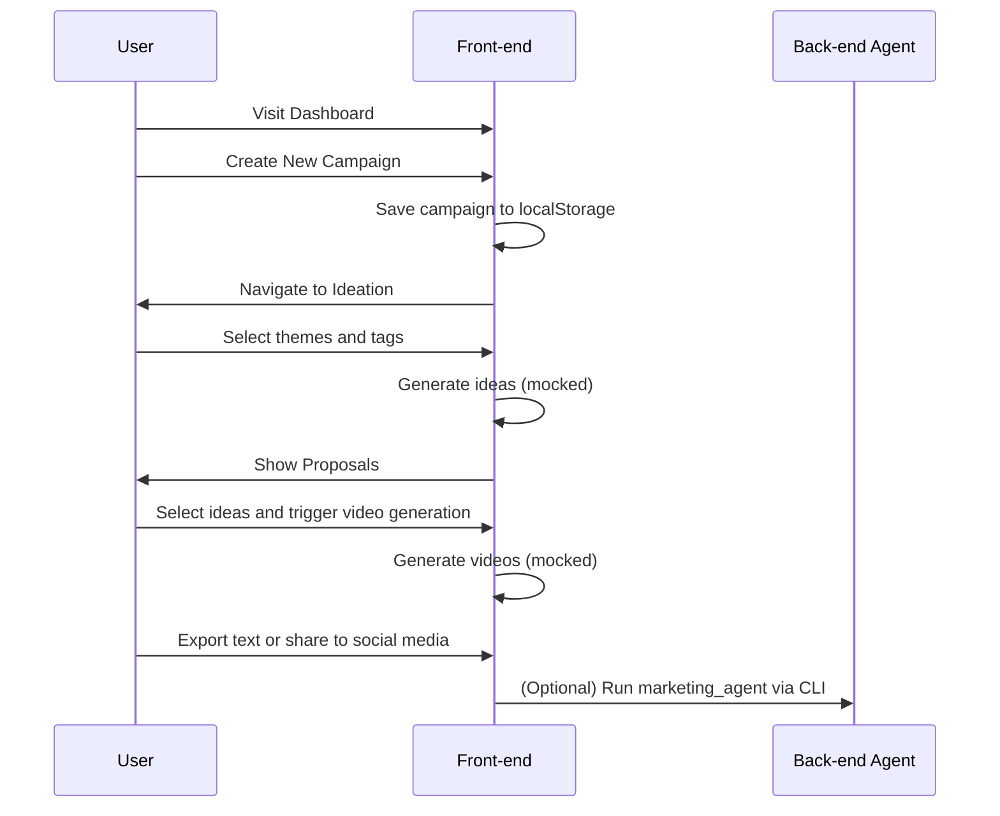

# Solution Architecture Overview

This document summarizes the current state of the project and provides both a high level and low level view of the implementation. It reconciles the code with the solution intent of enabling marketers to create a campaign, generate social posts, and eventually produce image and video content via Gemini/Veo.

## High Level Design (HLD)

The solution currently consists of a small Python back‑end agent and a React front‑end. There is no persistent server or database yet—the front‑end stores data in browser local storage and the Python agent is executed manually.

```mermaid
flowchart TD
    subgraph Front-end (React)
        A[New Campaign Page]
        B[Ideation Page]
        C[Proposals Page]
        D[Dashboard]
        A --> B --> C
        C --> D
    end

    subgraph Back-end (Python ADK)
        E[marketing_agent.py]
    end

    A -- campaign data --> D
    B -- ideas/tags/themes --> C
    C -- optional call --> E
```

- **Front-end**: Built with Vite and React. It guides a user through creating a campaign, selecting themes/tags, and viewing generated ideas. All AI functionality is currently mocked.
- **Back-end**: `backend/marketing_agent.py` defines a `SequentialAgent` using Gemini to summarize a business, generate campaign ideas, and create short social posts. It is run via the ADK CLI.
- **Data Storage**: Campaigns are stored in browser `localStorage`. There is no backend service or database yet.
- **Future Direction**: Integrating Gemini/Veo for real image and video generation, ingesting user uploads/URLs, and persisting campaigns in Firestore or another database.

## Low Level Design (LLD)

### Front-end Modules



- **`MarketingContext`** (`src/contexts/MarketingContext.tsx`)
  - Holds the array of campaigns, the currently loaded campaign, generated ideas, and selected tags/themes.
  - Provides actions to create campaigns, generate ideas (mocked), generate videos (mocked), toggle selected ideas, and export results to a text file.
  - Persists campaigns and the current campaign in `localStorage`.

- **Pages**
  - **DashboardPage** lists saved campaigns from local storage. Users can load an existing campaign or create a new one.
  - **NewCampaignPage** captures the campaign name, objective, description, and optional example content.
  - **IdeationPage** displays an AI summary, suggested themes, and suggested tags. The user selects themes/tags and optionally a preferred design language before generating ideas.
  - **ProposalsPage** shows generated ideas, allows selection of ideas for video generation, and (once implemented) will display generated videos and social posts.

- **Components** (under `src/components`) provide Material‑style UI elements such as `MaterialButton`, `MaterialCard`, and `MaterialVideoCard`.

### Back-end Agent



- The `SummaryAgent` summarizes the user provided business description and objective.
- The `IdeaAgent` generates three campaign ideas using that summary.
- The `SocialPostAgent` writes short social posts for each idea.
- These agents run sequentially when executed via `google.adk.cli`.

## User Flow Summary



At present the AI calls are mocked in the front-end. The Python agent demonstrates how a sequential flow could be implemented with Gemini, but it is not connected to the React app. In future iterations, the front-end would call a backend service that wraps `marketing_agent.py`, integrate file/URL uploads, and store campaign data in Firestore or another database.

