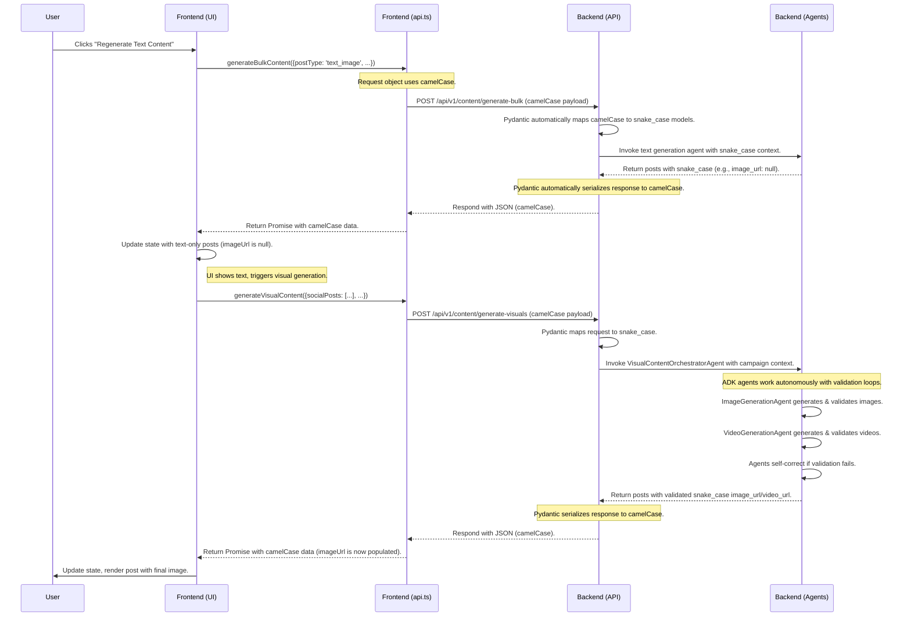
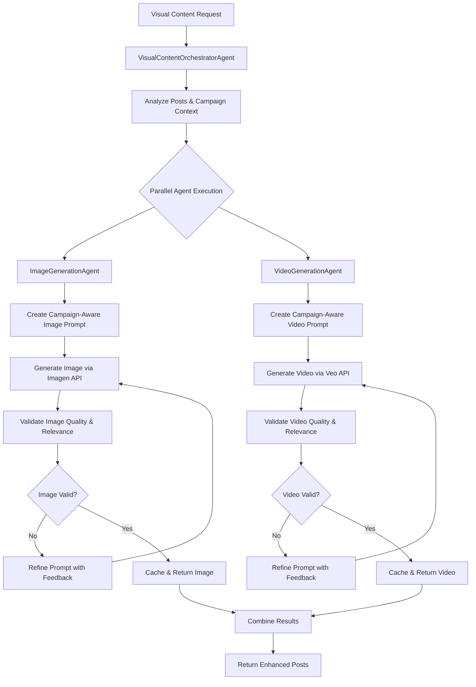

# Low-Level Design (LLD): Solution Architecture & Data Flow

**Date**: 2025-06-25
**Status**: Active
**Author**: JP

## 1. Overview

This document provides a low-level design of the AI Marketing Campaign Post Generator, focusing on the data architecture, object structures, and data flow. The goal is to establish a clear and unambiguous data contract between the frontend, backend API, and the ADK-based agent system. This document is the canonical reference for all data objects and their properties.

### 1.1. System Components

-   **Frontend**: A React/TypeScript single-page application (SPA) responsible for user interaction, campaign management, and rendering generated content. It uses `camelCase` for all its internal state and object properties.
-   **Backend API**: A Python/FastAPI application that serves as the gateway between the frontend and the agentic system. Per **[ADR-018](./ADR-018-Backend-CamelCase-API-Contract.md)**, it automatically serializes all JSON responses to `camelCase` to match the frontend's convention.
-   **Agentic System (ADK)**: A multi-agent system built with the Google Agent Development Kit (ADK). It includes a `MarketingOrchestrator` for campaign analysis and text generation, plus a specialized `VisualContentOrchestratorAgent` that coordinates autonomous `ImageGenerationAgent` and `VideoGenerationAgent` with validation and self-correction capabilities (per ADR-019).

---

## 2. Data Flow Architecture

The generation of content follows a two-phase process: first text generation, then autonomous visual generation. This ensures a fast user response for text, while the more time-consuming agentic visual generation (with validation and self-correction) happens subsequently.

### 2.0. Agentic Visual Content Generation (ADR-019)

The visual content generation now uses true ADK agents with autonomous capabilities:

1. **VisualContentOrchestratorAgent** (SequentialAgent): Coordinates the overall visual content workflow
2. **ImageGenerationAgent** (LlmAgent): Autonomously generates and validates images with self-correction
3. **VideoGenerationAgent** (LlmAgent): Autonomously generates and validates videos with self-correction

Each agent includes:
- **Campaign Context Integration**: System prompts include campaign creative guidance
- **Autonomous Validation**: Agents validate their own work for quality and relevance
- **Self-Correction**: Agents iterate and improve outputs if validation fails
- **Parallel Processing**: Image and video agents work concurrently for efficiency

### 2.1. Sequence Diagram

This diagram illustrates the simplified end-to-end data flow. The backend handles the data format convention, creating a seamless contract.



---

## 3. ADK Agentic Visual Content Architecture (ADR-019)

### 3.1. Agent Hierarchy

```
VisualContentOrchestratorAgent (SequentialAgent)
├── ImageGenerationAgent (LlmAgent)
│   ├── Campaign Context Analysis
│   ├── Imagen API Integration
│   ├── Autonomous Validation
│   └── Self-Correction Loop
└── VideoGenerationAgent (LlmAgent)
    ├── Campaign Context Analysis
    ├── Veo API Integration
    ├── Autonomous Validation
    └── Self-Correction Loop
```

### 3.2. Autonomous Agent Capabilities

#### 3.2.1. ImageGenerationAgent Features
- **Campaign-Aware Prompting**: Integrates campaign guidance into system prompts
- **Contextual Analysis**: Analyzes post content and business context
- **Quality Validation**: Validates generated images for relevance and quality
- **Iterative Improvement**: Self-corrects based on validation feedback
- **Caching Strategy**: Caches successful generations for consistency

#### 3.2.2. VideoGenerationAgent Features
- **Campaign-Aware Prompting**: Integrates campaign guidance into system prompts
- **Contextual Analysis**: Analyzes post content and business context
- **Quality Validation**: Validates generated videos for relevance and quality
- **Iterative Improvement**: Self-corrects based on validation feedback
- **Duration Optimization**: Optimizes video length for social media platforms

#### 3.2.3. Validation Framework
Each agent includes a comprehensive validation process:

1. **Content Relevance Check**: Does the visual match the post content?
2. **Campaign Alignment Check**: Does it align with campaign objectives?
3. **Brand Consistency Check**: Does it match the business context?
4. **Technical Quality Check**: Is the generated content technically sound?
5. **Platform Optimization Check**: Is it optimized for target platforms?

### 3.3. Agentic Workflow Process



---

## 4. Data Transformation Strategy

As defined in **[ADR-018](./ADR-018-Backend-CamelCase-API-Contract.md)**, there is **no data transformation on the frontend**. The backend is solely responsible for providing a `camelCase` JSON API.

-   **API Contract**: The API serves `camelCase`. The frontend consumes `camelCase`.
-   **Simplicity**: This removes a layer of complexity and a potential source of errors from the frontend, leading to a more robust and maintainable system.

---

## 4. API Data Object Reference

This section details the structure of the primary data objects as consumed by the frontend.

### 4.1. `SocialMediaPost` Object

This is the core object representing a single piece of generated content.

| Property (`camelCase`) | Type     | Description                                                                 |
| ---------------------- | -------- | --------------------------------------------------------------------------- |
| `id`                   | `string` | Unique identifier for the post (UUID).                                      |
| `type`                 | `string` | The type of post, e.g., 'text_image', 'text_video', 'text_url'.             |
| `content`              | `string` | The main text body of the social media post.                                |
| `hashtags`             | `string[]` | An array of suggested hashtags.                                             |
| `imageUrl`             | `string \| null` | URL of the generated image. Is `null` after text generation.                |
| `videoUrl`             | `string \| null` | URL of the generated video. Is `null` after text generation.                |
| `productUrl`           | `string \| null` | The URL to the business's product or service page.                          |
| `engagementScore`      | `number` | An AI-predicted score for the post's potential engagement.                  |
| `platformOptimized`    | `object` | An object containing platform-specific guidance or notes.                   |
| `selected`             | `boolean`| A flag indicating if the user has selected the post for scheduling.         |
| `imagePrompt`          | `string \| null` | The final, enhanced prompt sent to the Imagen model.                        |
| `videoPrompt`          | `string \| null` | The final, enhanced prompt sent to the Veo model.                           |
| `error`                | `string \| null` | An error message if content generation failed for this specific item.       |


### 4.2. `BusinessContext` Object

This object carries the comprehensive campaign context used by all agents.

| Property (`camelCase`)  | Type     | Description                                                              |
| ------------------------- | -------- | ------------------------------------------------------------------------ |
| `companyName`             | `string` | Name of the business.                                                    |
| `objective`               | `string` | The primary goal of the marketing campaign (e.g., 'increase awareness'). |
| `campaignType`            | `string` | Type of campaign (e.g., 'brand', 'product').                             |
| `targetAudience`          | `string` | Description of the target audience.                                      |
| `businessDescription`     | `string` | A detailed description of the business.                                  |
| `businessWebsite`         | `string` | The main URL for the business.                                           |
| `productServiceUrl`       | `string` | A specific URL for a product or service.                                 |
| `campaignMediaTuning`     | `string` | User-provided fine-tuning instructions for visuals.                      |
| `campaignGuidance`        | `object` | AI-generated guidance object (contains themes, visual style, etc.).      |
| `productContext`          | `object` | AI-generated context for a specific product.                             |

### 4.3. `/generate-visuals` API Endpoint

-   **Request Payload:**
    ```typescript
    {
      socialPosts: SocialMediaPost[],
      businessContext: BusinessContext,
      campaignObjective: string,
      campaignId: string
    }
    ```
-   **Response Payload:**
    ```typescript
    {
      postsWithVisuals: SocialMediaPost[], // Now with imageUrl/videoUrl populated
      generationMetadata: object
    }
    ```

This LLD provides a solid foundation for understanding the data flow and object structures within the application, ensuring consistency and reducing bugs. 